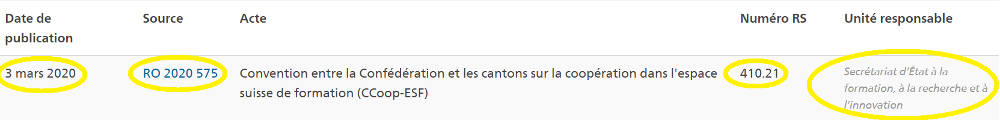

# Projet de visualisation de l'évolution législative en Suisse 

## Description
Le présent projet s’inscrit dans le cadre du cours de Visualisation des données dispensé par M. Isaac Pante à l’Université de Lausanne au semestre du printemps 2021. Il a pour objet de permettre la visualisation de l’œuvre de l’Assemblée fédérale suisse selon plusieurs perspectives, notamment : 
-	**chronologique** : en permettant de suivre le travail du législateur au fil des mois et des années ; 
-	**quantitative** : le projet intègre la possibilité d’agréger les objets législatifs afin de se rendre compte du nombre de lois votées par mois, par année ou sur toute la période donnée, ainsi que la taille de chaque loi ; 
-	**qualitative** : la couleur des éléments permet en outre de déterminer les thématiques et sous-thématiques relatives à chaque loi.

L’objectif poursuivi est de permettre à l’utilisateur d’observer le travail effectué par le législateur et de pouvoir tirer ses propres conclusions par exemple sur les cycles régissant l’Assemblée , les thématiques qui y sont abordées, les priorités du législateur etc. 

### Illustration du graphique agrégé 

### Illustration du graphique chronologique

## Installation et mise en place
Pour installer le programme, il est nécessaire de télécharger et d'extraire les fichiers sur un serveur local ou distant (Sur GitHub, cliquer sur "Code" puis "Download Zip", extraire le fichier dans le dossier souhaité).

Le programme n'étant pas encore hébergé sur un site internet, il peut être consulté en local en téléchargeant un logiciel d'édition de codes (comme  **[Visual Studio Code](https://code.visualstudio.com/download)**, en installant l'extension **[Live Server](https://marketplace.visualstudio.com/items?itemName=ritwickdey.LiveServer)**).

Depuis Visual Code Studio avec l'extension Live Server, ouvrir le dossier téléchargé en cliquant sur "Fichier" puis "Ouvrir le dossier". Le script peut désormais être lancé en cliquant sur le bouton en bas à droite de l'écran **Go Live**. 

Le logiciel utilisant une version en ligne de la librairie de visualisation D3.JS, une connexion à internet est requise.

## Base de données
Deux bases de données sont principalement utilisées afin d’alimenter le projet : 
-	le **[Recueil officiel](https://www.fedlex.admin.ch/fr/oc?news_period=last_day&news_pageNb=1&news_order=desc&news_itemsPerPage=10)** : dont sont uniquement extraites les lois fédérales définitivement votées par l’Assemblée fédérale et publiées (pour les besoins de la visualisation, ne sont pas compris dans la base de données les ordonnances, règlements, arrêtés pris par le pouvoir exécutif) ; 
-	le **[Recueil systématique](https://www.fedlex.admin.ch/fr/cc?news_period=last_day&news_pageNb=1&news_order=desc&news_itemsPerPage=10)** : dont sont extraits les listes de thématiques législatives ainsi que leurs codes correspondants afin de permettre d’identifier la thématique de chaque objet législatif dans la base de données.

## Données
Pour chaque loi, la base données contient plusieurs informations : 
-	le nom de la loi ;
-	la date de publication de la loi ;
-	la date du vote ou de la modification de la loi ;
-	le numéro au Recueil officiel ;
-	un lien hypertexte vers le Recueil officiel ;
-	l’unité administrative responsable de la loi ; 
-	le nombre de pages de la loi.

À ce stade, les données ont été recueillies sur **10 ans** (de 2010 à 2020). Le projet et sa base de données ont toutefois été conçus afin de permettre une mise à jour des prochaines lois (pour les années 2021 et suivantes) ainsi qu’un enrichissement (pour les années 2009 et antérieures).

## Auteurs
**Aurélien Hamouti** (développeur): développement et programmation du code principal et intégration à GitHub.

**Catherine Döbeli et David Pressouyre** (juristes) : création, enrichissement et mise à jour des bases de données et assistance au développement.

## Droits d'auteurs
Copyright@ Tout droits réservés

**************************************************************************************************

# Project to visualize the legislative evolution in Switzerland 

## Description
This project is part of the Data Visualization course taught by Mr. Isaac Pante at the University of Lausanne during the spring 2021 semester. It aims to allow the visualization of the work of the Swiss Federal Assembly from several perspectives, including: 
- **Chronological**: by allowing to follow the work of the legislator over the months and years; 
- **Quantitative**: the project integrates the possibility to aggregate the legislative objects in order to see the number of laws passed per month, per year or over the whole given period, as well as the size of each law; 
- **Qualitative**: the color of the elements also makes it possible to determine the themes and sub-themes related to each law.

The objective is to allow the user to observe the work done by the legislator and to be able to draw his or her own conclusions, for example, on the cycles governing the Assembly, the themes addressed, the legislator's priorities, etc. 

### Illustration of the aggregated graph 

### Illustration of the chronological graph

## Installation and setup
To install the program, it is necessary to download and extract the files on a local or remote server (on GitHub, click on "Code" then "Download Zip", extract the file in the desired folder).

As the program is not yet hosted on a website, it can be consulted locally by downloading a code editing software (like **[Visual Studio Code](https://code.visualstudio.com/download)**, by installing the **[Live Server](https://marketplace.visualstudio.com/items?itemName=ritwickdey.LiveServer)** extension).

From Visual Code Studio with the Live Server extension, open the downloaded file by clicking on "File" then "Open the file". tTe script can now be launched by clicking on the button at the bottom right of the **Go Live** screen. 

As the software uses an online version of the D3.JS visualization library, an internet connection is required.

## Database
Two databases are mainly used to feed the project: 
- the **[Recueil Officiel](https://www.fedlex.admin.ch/fr/oc?news_period=last_day&news_pageNb=1&news_order=desc&news_itemsPerPage=10)** : from which are extracted only the federal laws definitively voted by the Federal Assembly and published (for the needs of the visualization, ordinances, regulations, decrees taken by the executive power are not included in the database) ; 
- the **[Recueil systématique](https://www.fedlex.admin.ch/fr/cc?news_period=last_day&news_pageNb=1&news_order=desc&news_itemsPerPage=10)** : from which are extracted the lists of legislative themes as well as their corresponding codes in order to identify the theme of each legislative object in the database.

## Data
For each law, the database contains several information: 
- its name;
- its date of publication;
- its date of vote or modification;
- its number in the Recueil Officiel;
- an hyperlink to the Recueil Officiel;
- the administrative unit responsible for the law; 
- its size in number of pages.

At this stage, data has been collected for **10 years** (2010 to 2020). However, the project and its database have been designed to allow for updating of future laws (for the years 2021 onwards) as well as enrichment (for the years 2009 onwards).

## Authors
**Aurélien Hamouti** (developer): development and programming of the main code and integration to GitHub.

**Catherine Döbeli and David Pressouyre** (lawyers): creation, enrichment and update of the databases and development assistance.

## Copyrights
Copyright@ All rights reserved

